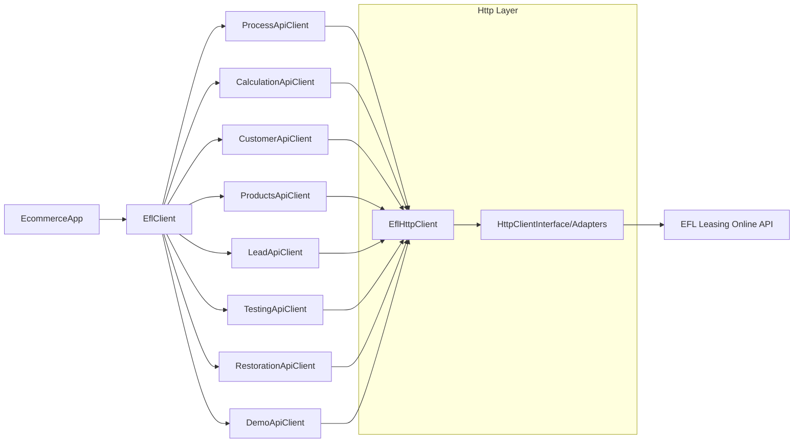

# Imoli EFL Leasing PHP SDK

Imoli EFL Leasing SDK is a PHP library that simplifies integrating **EFL Leasing Online** as a payment method in ecommerce platforms.
It provides a PHP-friendly, testable abstraction over the official EFL Leasing Online sandbox and production APIs.

> Public APIs follow SemVer from 1.0.0 onwards. Pre-1.0 releases may introduce breaking changes.

## Installation

Install the package via Composer:

```bash
composer require imoli-pl/efl-leasing-sdk
```

## Requirements

- PHP ^8.2
- `ext-json`
- Composer for dependency management

## Documentation

Local technical documentation for this SDK is available in the `docs/` directory.
Files and directories are numbered for correct ordering in documentation generators (e.g. Nuxt Content).

- `docs/1.overview.md` – high-level overview and when to use the SDK.
- `docs/2.installation.md` – installation and requirements.
- `docs/3.quickstart.md` – first steps and basic offer calculation.
- `docs/4.configuration.md` – environment and HTTP client configuration.
- `docs/2.concepts/` – core concepts (leasing flow, SDK architecture, error handling, models and builders).
- `docs/5.api/` – API clients overview, models overview, error handling.
- `docs/5.api/4.reference/` – full API reference (EflClient methods, Config, clients, builders, models, HTTP, exceptions, enums).
- `docs/6.guides/` – sandbox setup, integration patterns and a full payment flow example that mirrors the sandbox documentation while using the SDK instead of raw HTTP.
- `docs/7.development/` – setup, conventions, testing and contributing for SDK developers (including detailed coding conventions).

## Architecture overview



- `EflClient` – main entry point for ecommerce integrations. Provides high-level methods that orchestrate calls to the EFL Leasing Online API.
- `Config` – immutable configuration value object (API key, environment, base URL) with helpers `Config::sandbox()` and `Config::production()`.
- `Environment` – enum for `Sandbox` and `Production`.
- `HttpClientInterface` – abstraction over HTTP layer, allowing you to plug in your own client.
- `EflHttpClient` – HTTP helper that builds URLs, applies authentication headers and maps API errors to `ApiException`.
- `NativeHttpClient` – minimal placeholder implementation (throws until implemented).
- `GuzzleHttpAdapter` and `SymfonyHttpAdapter` – ready-to-use adapters when you have Guzzle or Symfony HttpClient installed.
- `Exception` namespace – base `EflLeasingException` and more specific exception types.

## External API documentation

The SDK is designed to follow the official **EFL Leasing Online** API contract.
For details about endpoints, request/response schemas and authentication, refer to:

- EFL Leasing Online sandbox documentation:  
  `https://leasingonline-sandbox.efl.com.pl/sandboxDocumentationPage`
- EFL Leasing Online sandbox OpenAPI (Swagger) definition:  
  `https://leasingonlineapi-sandbox.efl.com.pl/swagger/v1/swagger.json`

## HTTP client adapters

When using Guzzle or Symfony HttpClient, you can use the provided adapters:

```php
// With Guzzle
use GuzzleHttp\Client;
use Imoli\EflLeasingSdk\Http\Adapter\GuzzleHttpAdapter;

$guzzle = new Client();
$httpClient = new GuzzleHttpAdapter($guzzle);
$client = new EflClient($config, $httpClient);
```

```php
// With Symfony HttpClient
use Imoli\EflLeasingSdk\Http\Adapter\SymfonyHttpAdapter;
use Symfony\Component\HttpClient\HttpClient;

$symfonyClient = HttpClient::create();
$httpClient = new SymfonyHttpAdapter($symfonyClient);
$client = new EflClient($config, $httpClient);
```

Install the corresponding package: `composer require guzzlehttp/guzzle` or `composer require symfony/http-client`.

## Production usage

### Configuration

- Use `Config::production('YOUR_API_KEY', 'YOUR_BASE_URL')` for production. Obtain the base URL from EFL when production access is granted. Do not use sandbox credentials in production.
- Provide a robust HTTP client implementation. `NativeHttpClient` is a placeholder and throws when used; use `GuzzleHttpAdapter` or `SymfonyHttpAdapter` instead.
- Configure timeouts on your HTTP client (e.g. Guzzle `timeout` and `connect_timeout`) to avoid hanging requests. Recommended: 15–30 seconds for most operations.

```php
// Example: Guzzle with timeouts
$guzzle = new Client([
    'timeout' => 30,
    'connect_timeout' => 10,
]);
$httpClient = new GuzzleHttpAdapter($guzzle);
```

### Error handling

- All API and transport errors are thrown as `EflLeasingException` subclasses (`ApiException` for HTTP 4xx/5xx, `HttpException` for transport failures).
- Catch `ApiException` to access `getStatusCode()` and `getProblemDetails()` (RFC 7807) for structured error responses.
- Implement retries only for transient failures (e.g. 5xx, timeouts). Do not retry 4xx client errors without changing the request.

```php
try {
    $offer = $client->calculateBasicOffer($basket, $token);
} catch (\Imoli\EflLeasingSdk\Exception\ApiException $e) {
    $statusCode = $e->getStatusCode();
    $details = $e->getProblemDetails();
    // Log, notify, or handle based on $statusCode and $details
}
```

### Limitations

- The SDK does not implement retries or circuit breakers. Implement these in your application or HTTP client layer if needed.
- `FoicProcessStateResponse` fields `response`, `warning` and `processedResponse` are dynamically typed; their structure depends on the process status.
- API version compatibility: the SDK aligns with the EFL Leasing Online API as documented in the sandbox Swagger. Production API changes may require SDK updates.

### Monitoring

- Log requests and responses via `RequestLoggerInterface` when debugging or auditing.
- Monitor `ApiException` and `HttpException` in your error tracking (e.g. Sentry, Bugsnag) to detect integration issues.

## Builders

All request models expose `Model::builder()` for fluent construction. You can mix builders with direct constructors:

```php
use Imoli\EflLeasingSdk\Model\Customer\Address;
use Imoli\EflLeasingSdk\Model\Customer\Company;
use Imoli\EflLeasingSdk\Model\Customer\CustomerData;
use Imoli\EflLeasingSdk\Model\Customer\CustomerDataStatement;
use Imoli\EflLeasingSdk\Model\Customer\EmailAddress;
use Imoli\EflLeasingSdk\Model\Customer\Phone;

$company = Company::builder('company-guid', '1234567890')
    ->addEmail(new EmailAddress('email-guid', 'contact@example.com', 'work'))
    ->addPhone(new Phone('phone-guid', '+48', '123456789', 'mobile', 'mobile'))
    ->addAddress(new Address('addr-guid', 'Headquarters', 'registered_office', 'Warsaw', 'Main St', '1', '00-001', 'PL'))
    ->addStatement(new CustomerDataStatement('stmt-guid', true, 'gdpr'))
    ->build();

$customerData = CustomerData::builder('tx-1', 42)->withCompany($company)->build();
```

## Development

After cloning the repository, install dependencies:

```bash
composer install
```

Run the test suite:

```bash
composer test
```

Generate code coverage report (requires [PCOV](https://github.com/krakjoe/pcov) or [Xdebug](https://xdebug.org/)):

```bash
composer test:coverage
```

This prints a text report to the console and generates an HTML report in `build/coverage/`.

If you see `Unable to load dynamic library 'pcov.so'`, PHP is configured to load PCOV but the extension is missing. Either remove `extension=pcov.so` from your `php.ini` (see `php --ini` for the config path), or install PCOV with `pecl install pcov`. Alternatively, use Xdebug for coverage.

Run integration tests (against the EFL sandbox API; requires `EFL_API_KEY` and `EFL_PARTNER_ID` environment variables):

```bash
EFL_API_KEY=your-sandbox-api-key EFL_PARTNER_ID=your-partner-id composer test:integration
```

Without these variables, integration tests are skipped. See the [sandbox documentation](https://leasingonline-sandbox.efl.com.pl/sandboxDocumentationPage) for obtaining credentials.

You can also copy `.env.example` to `.env` and use your preferred dotenv loader (for example in your application or local tooling) to provide these variables to the SDK and integration tests.

Run static analysis:

```bash
composer phpstan
```

Check coding standards:

```bash
composer cs-check
```

Automatically fix coding standards where possible:

```bash
composer cs-fix
```

## Typical backend flow

A typical leasing flow in an ecommerce backend can be implemented as:

1. **Initialise configuration and HTTP client**
   - Create `Config` using `Config::sandbox()` or `Config::production()`.
   - Provide an implementation of `HttpClientInterface` (or use `NativeHttpClient` as a starting point).
2. **Obtain auth token**
   - Call `EflClient::getAuthToken()` with your `partnerId` to obtain a token that will be used as a Bearer token for subsequent calls.
3. **Start the leasing process**
   - Call `EflClient::startProcess()` with positive/negative return URLs and the Bearer token to initialise the process and obtain the initial URL / identifier.
4. **Calculate offers**
   - Build an `AssetToCalculation` basket using `OfferItem` and `ItemDetail`.
   - Call `EflClient::calculateBasicOffer()` to obtain a typed `EsbCalculateBasicOfferRestReturn` with offer variants. If you need raw JSON, use the corresponding `CalculationApiClient` method directly.
5. **Submit customer data and statements**
   - Build `CustomerData` (including `Company`, `Person`, `Address`, `EmailAddress`, `Phone`, `CustomerDataStatement`).
   - Call `EflClient::submitCustomerData()` and the lower-level `CustomerApiClient` methods where needed.
6. **Identity verification and pay‑by‑link**
   - Build `VerificationInitializationParams` and pass it to `EflClient::initializeIdentityVerification()` to obtain redirect URL and order UUID.
   - Poll status with `EflClient::getIdentityVerificationStatus()`.
7. **Leads and contact forms**
   - Build `ContactData` and send it via `EflClient::sendContactForm()` to register a lead in EFL systems.

Frontend plugins can then use the data and URLs returned by these methods to build the user experience specific to a given ecommerce platform.

## Contributing

Contributions are welcome. Please ensure that:

- Code is written in English (class names, methods, variables and comments), except for proper names (e.g. “EFL Leasing”).
- New code follows PSR-12 and uses strict typing (`declare(strict_types=1);`).
- Public APIs are documented with PHPDoc where needed to clarify intent and behaviour.
- All tests and static analysis checks pass before opening a pull request.

## License

This project is licensed under the MIT License. See the `LICENSE` file for details.

