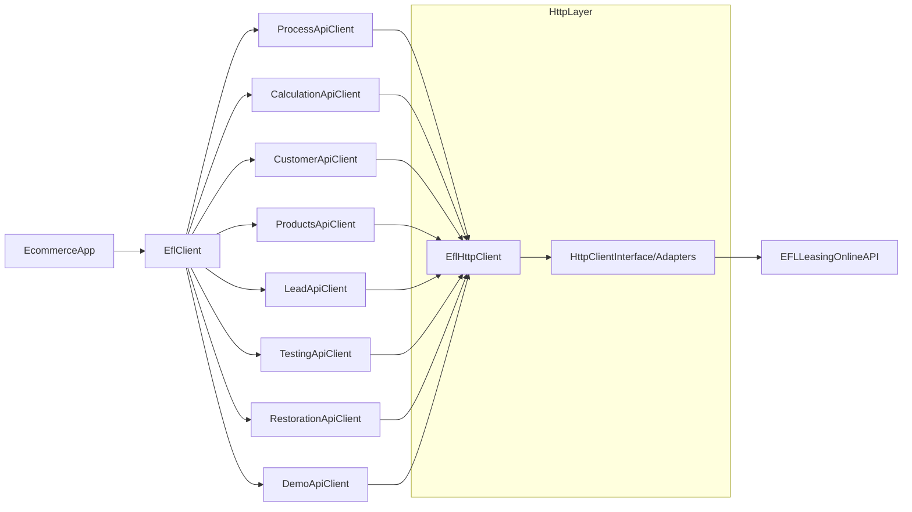

## What is the EFL Leasing PHP SDK?

The Imoli EFL Leasing PHP SDK is a PHP library that simplifies integrating **EFL Leasing Online** as a payment method in ecommerce platforms.
It provides a PHP-friendly, testable abstraction over the official EFL Leasing Online sandbox and production APIs.

You can use this SDK to:

- Integrate leasing as a payment option in your checkout.
- Calculate leasing offers for baskets of assets.
- Submit customer data and declarations.
- Orchestrate identity verification and pay‑by‑link flows.
- Restore sessions and processes after signing.

## High-level architecture

At a high level, the SDK is split into:

- `EflClient` – main entry point for ecommerce integrations, exposing high-level methods for typical flows.
- API clients in the `Api` namespace – low-level clients for individual API groups (calculation, customer, products, lead, process, restoration, testing, demo).
- `Config` and `Environment` – configuration of API key, environment (sandbox/production) and base URL.
- HTTP layer (`Http` namespace) – pluggable HTTP client abstraction with ready-to-use adapters for Guzzle and Symfony HttpClient.
- Models in the `Model` namespace – immutable value objects representing requests and responses.
- Builders in the `Builder` namespace – fluent builders used to construct complex models.
- Exceptions in the `Exception` namespace – consistent error types for transport and API errors.

The following diagram shows how typical applications interact with the SDK:

## When should you use this SDK?

Use this SDK when:

- You need to offer leasing as a payment method in an ecommerce or B2B portal.
- You prefer working with typed PHP classes instead of manually building HTTP requests.
- You want a single integration point that handles authentication, error mapping and model construction.

You probably **should not** use this SDK if:

- You only need to experiment with raw HTTP calls or one-off scripts (in that case, working directly with the sandbox documentation may be enough).
- You are building a non-PHP backend and cannot embed a PHP library.

## Next steps

- Read [Getting started](02.getting-started.md) to see how to configure the SDK and make your first request.
- Check [Installation](03.installation.md) for environment requirements and Composer installation.
- Use [Quickstart](04.quickstart.md) to follow a full minimal integration example.
- Explore the [API section](06.api/01.overview.md) for detailed information about clients, models and errors.
