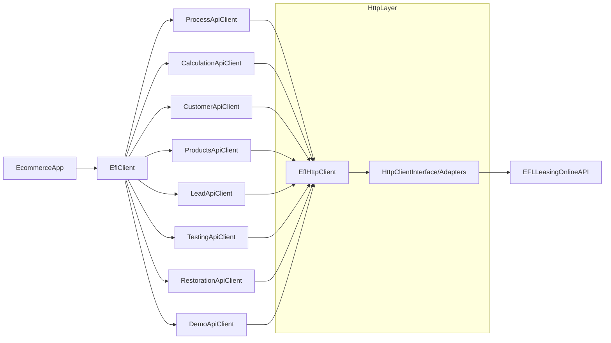

## Czym jest EFL Leasing PHP SDK?

Imoli EFL Leasing PHP SDK to biblioteka PHP, która upraszcza integrację **EFL Leasing Online** jako metody płatności w platformach ecommerce.
Dostarcza przyjazną dla PHP, testowalną abstrakcję nad oficjalnymi API sandbox i produkcyjnym EFL Leasing Online.

Możesz użyć tego SDK do:

- Integracji leasingu jako opcji płatności w procesie zamówienia (checkout).
- Obliczania ofert leasingowych dla koszyków przedmiotów.
- Przesyłania danych klienta i oświadczeń.
- Orkiestracji weryfikacji tożsamości i przepływów pay‑by‑link.
- Przywracania sesji i procesów po podpisaniu.

## Architektura wysokopoziomowa

Na wysokim poziomie SDK jest podzielone na:

- `EflClient` – główny punkt wejścia dla integracji ecommerce, udostępniający wysokopoziomowe metody dla typowych przepływów.
- Klienci API w przestrzeni nazw `Api` – niskopoziomowi klienci dla poszczególnych grup API (kalkulacja, klient, produkty, lead, proces, przywracanie, testowanie, demo).
- `Config` i `Environment` – konfiguracja klucza API, środowiska (sandbox/produkcja) i bazowego adresu URL.
- Warstwa HTTP (przestrzeń nazw `Http`) – wymienna abstrakcja klienta HTTP z gotowymi adapterami dla Guzzle i Symfony HttpClient.
- Modele w przestrzeni nazw `Model` – niezmienne obiekty wartości (value objects) reprezentujące żądania i odpowiedzi.
- Buildery w przestrzeni nazw `Builder` – płynne buildery (fluent builders) używane do budowania złożonych modeli.
- Wyjątki w przestrzeni nazw `Exception` – spójne typy błędów dla błędów transportu i API.

Poniższy diagram pokazuje, jak typowe aplikacje wchodzą w interakcję z SDK:

## Kiedy powinieneś używać tego SDK?

Użyj tego SDK, gdy:

- Musisz oferować leasing jako metodę płatności w portalu ecommerce lub B2B.
- Preferujesz pracę z typowanymi klasami PHP zamiast ręcznego budowania żądań HTTP.
- Chcesz mieć pojedynczy punkt integracji, który obsługuje uwierzytelnianie, mapowanie błędów i budowanie modeli.

Prawdopodobnie **nie powinieneś** używać tego SDK, jeśli:

- Musisz jedynie eksperymentować z surowymi wywołaniami HTTP lub jednorazowymi skryptami (w takim przypadku praca bezpośrednio z dokumentacją sandbox może być wystarczająca).
- Budujesz backend w języku innym niż PHP i nie możesz osadzić biblioteki PHP.

## Następne kroki

- Przeczytaj [Wprowadzenie](/sdk/getting-started), aby zobaczyć, jak skonfigurować SDK i wykonać pierwsze zapytanie.
- Sprawdź [Instalację](/sdk/installation) pod kątem wymagań środowiskowych i instalacji przez Composer.
- Skorzystaj z [Szybkiego startu](/sdk/quickstart), aby przejść przez pełny, minimalny przykład integracji.
- Przeglądaj [sekcję API](/sdk/api/overview), aby uzyskać szczegółowe informacje o klientach, modelach i błędach.
