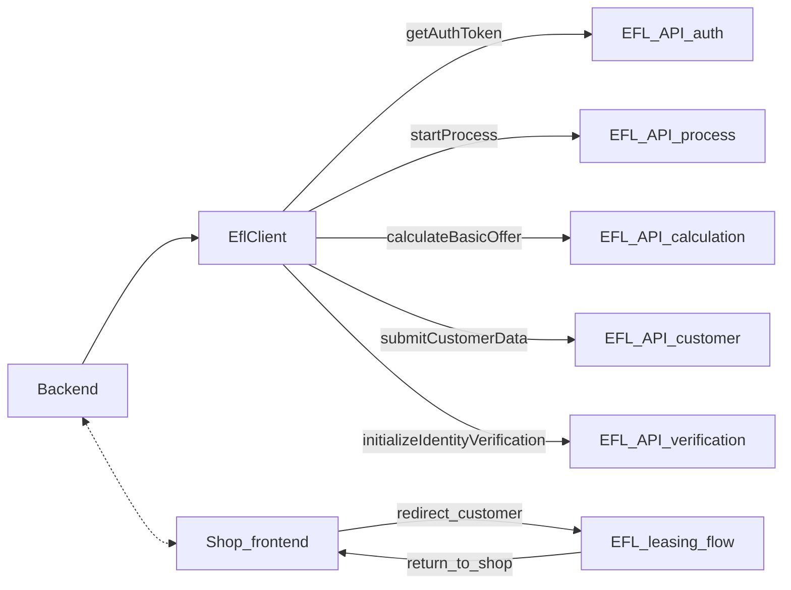

## Przegląd

Ten przewodnik przeprowadzi Cię przez uproszczony, ale realistyczny przepływ backendowy:

1. Konfiguracja SDK.
2. Pobranie tokena autoryzacyjnego i rozpoczęcie procesu.
3. Obliczenie oferty.
4. Przesłanie danych klienta.
5. Inicjalizacja weryfikacji tożsamości.

Obsługa błędów i logika ponowień zostały pominięte dla zachowania przejrzystości.

## 1. Konfiguracja SDK

```php
use GuzzleHttp\Client as GuzzleClient;
use Imoli\EflLeasingSdk\Config;
use Imoli\EflLeasingSdk\EflClient;
use Imoli\EflLeasingSdk\Http\Adapter\GuzzleHttpAdapter;

$config = Config::sandbox(
    apiKey: getenv('EFL_API_KEY'),
    baseUrl: 'https://leasingonlineapi-sandbox.efl.com.pl'
);

$guzzle = new GuzzleClient([
    'timeout' => 30,
    'connect_timeout' => 10,
]);

$httpClient = new GuzzleHttpAdapter($guzzle);

$client = new EflClient($config, $httpClient);
```

## 2. Uwierzytelnienie i rozpoczęcie procesu

```php
$partnerId = getenv('EFL_PARTNER_ID');

// Token Bearer zwrócony przez getAuthToken(), używany ponownie w kolejnych wywołaniach
$token = $client->getAuthToken($partnerId);

$process = $client->startProcess(
    positiveReturnUrl: 'https://example.com/efl/success',
    negativeReturnUrl: 'https://example.com/efl/failure',
    token: $token
);
```

Zapisz identyfikatory z obiektu `$process` w swojej bazie danych; będą Ci potrzebne później.

## 3. Obliczenie oferty

```php
use Imoli\EflLeasingSdk\Model\Calculation\AssetToCalculation;
use Imoli\EflLeasingSdk\Model\Calculation\OfferItem;
use Imoli\EflLeasingSdk\Model\Calculation\ItemDetail;

$itemDetail = new ItemDetail(
    guid: 'item-guid-1',
    description: 'Example asset'
    // ... dodatkowe pola zgodnie z wymaganiami
);

$offerItem = OfferItem::builder('offer-item-guid-1')
    ->withItemDetail($itemDetail)
    ->build();

$basket = AssetToCalculation::builder('basket-guid-1')
    ->addOfferItem($offerItem)
    ->build();

$offerResponse = $client->calculateBasicOffer($basket, $token);
```

Użyj `$offerResponse`, aby zaprezentować dostępne warianty klientowi.

## 4. Przesłanie danych klienta

```php
use Imoli\EflLeasingSdk\Model\Customer\Address;
use Imoli\EflLeasingSdk\Model\Customer\Company;
use Imoli\EflLeasingSdk\Model\Customer\CustomerData;
use Imoli\EflLeasingSdk\Model\Customer\CustomerDataStatement;
use Imoli\EflLeasingSdk\Model\Customer\EmailAddress;
use Imoli\EflLeasingSdk\Model\Customer\Phone;

$company = Company::builder('company-guid', '1234567890')
    ->addEmail(new EmailAddress('email-guid', 'contact@example.com', 'work'))
    ->addPhone(new Phone('phone-guid', '+48', '123456789', 'mobile', 'mobile'))
    ->addAddress(new Address('addr-guid', 'Headquarters', 'registered_office', 'Warsaw', 'Main St', '1', '00-001', 'PL'))
    ->addStatement(new CustomerDataStatement('stmt-guid', true, 'gdpr'))
    ->build();

$customerData = CustomerData::builder('tx-1', 42)
    ->withCompany($company)
    ->build();

$client->submitCustomerData($customerData, $token);
```

## 5. Inicjalizacja weryfikacji tożsamości

```php
use Imoli\EflLeasingSdk\Model\Verification\VerificationInitializationParams;

$params = VerificationInitializationParams::builder('order-uuid')
    // skonfiguruj zgodnie z wymaganiami dokumentacji EFL
    ->build();

$verificationResult = $client->initializeIdentityVerification(
    $processTransactionId,
    $params,
    $token
);

$redirectUrl = $verificationResult->getRedirectUrl();
```

Przekieruj klienta pod adres `$redirectUrl` i obsługuj aktualizacje statusu za pomocą punktów końcowych lub klientów statusu weryfikacji.

## 6. Diagram wysokopoziomowego przepływu


